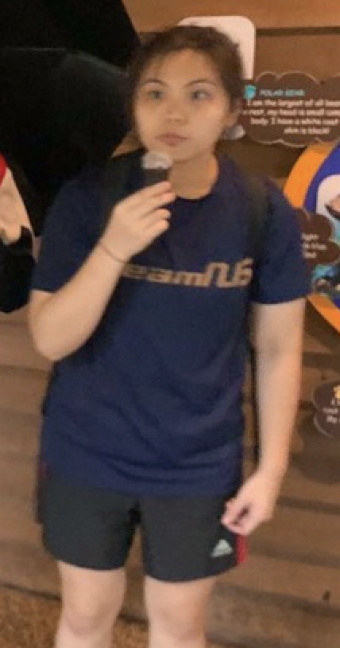
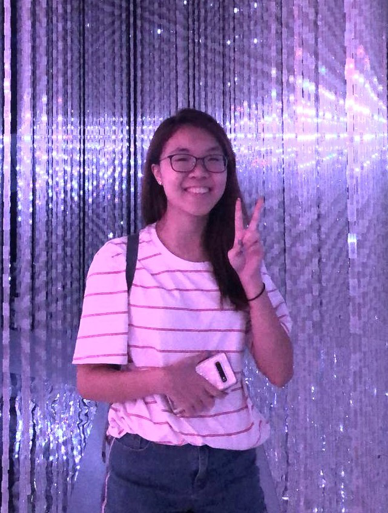
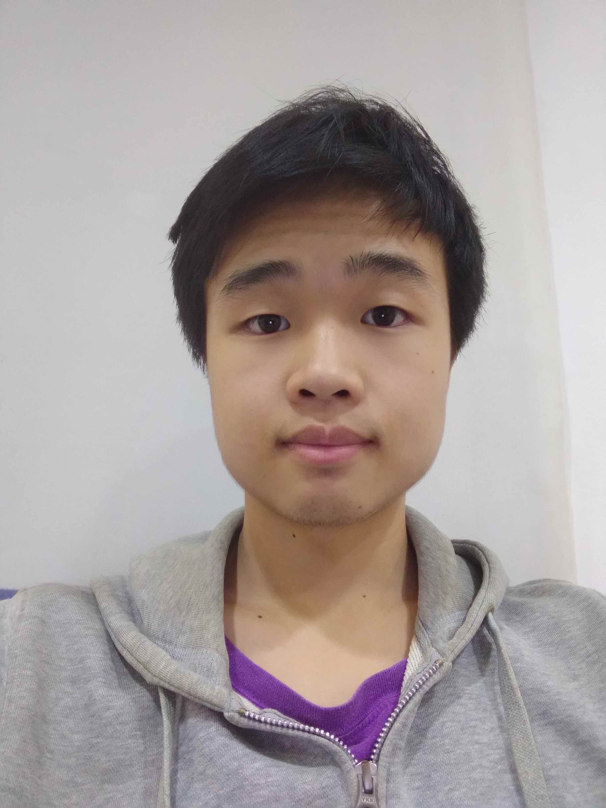

We are a team based in the [School of Computing, National University of Singapore](http://www.comp.nus.edu.sg).

You can reach us at the email `seer[at]comp.nus.edu.sg`

## Project team

### Liu Yuxi

[[github](http://github.com/liuyxxy)]

* Role: Code Quality

### Rachel Gina Abelarde

[[github](http://github.com/rgabelarde)]
[[portfolio](team/rgabelarde.md)]

* Role: Deliverables and Deadlines

### Jace Tan

[[github](http://github.com/jacetjy)]
[[portfolio](team/jacetjy.md)]

* Role: Integration

### Yong Shan Rong

[[github](http://github.com/ysr25)]
[[portfolio](team/ysr25.md)]

* Role: Documentation, Scheduling and Tracking

### Yuki Akizuki

[[github](http://github.com/yuki-cell)]
[[portfolio](team/yuki-cell.md)]

* Role: Testing, Code Quality
