* Table of Contents
{:toc}

--------------------------------------------------------------------------------------------------------------------

## **Setting up, getting started**

Refer to the guide [_Setting up and getting started_](SettingUp.md).

--------------------------------------------------------------------------------------------------------------------
## **Introduction**

### Purpose
This document specifies architecture and software design decisions for the desktop flashcard application, Bagel. It is
a living document that evolves throughout the design and implementation for each release.

### Scope
This describes the software architecture and software decisions for the implementation of Bagel. The intended audience
of this document is the developers, designers, and software testers of Bagel.

### Overview
This document focuses on 2 major parts: design and implementation. Under the Design section, you can find details of
the system architecture. Under the Implementation section, you can find details of the implementation of some of the
commands used in Bagel. In addition to the current document, separate documents and guides on how to use or test Bagel
have been included under the Documentation section of this document.

--------------------------------------------------------------------------------------------------------------------

## **Design**

### Architecture

The ***Architecture Diagram*** given above explains the high-level design of the App. Given below is a quick overview of each component.

**`Main`** has two classes called [`Main`](https://github.com/AY2021S1-CS2103T-W13-2/tp/blob/master/src/main/java/seedu/address/Main.java) and [`MainApp`](https://github.com/AY2021S1-CS2103T-W13-2/tp/blob/master/src/main/java/seedu/address/MainApp.java). It is responsible for,
* At app launch: Initializes the components in the correct sequence, and connects them up with each other.
* At shut down: Shuts down the components and invokes cleanup methods where necessary.

[**`Commons`**](#common-classes) represents a collection of classes used by multiple other components.

The rest of the App consists of four components.

* [**`UI`**](#ui-component): The UI of the App.
* [**`Logic`**](#logic-component): The command executor.
* [**`Model`**](#model-component): Holds the data of the App in memory.
* [**`Storage`**](#storage-component): Reads data from, and writes data to, the hard disk.

Each of the four components,

* defines its *API* in an `interface` with the same name as the Component.
* exposes its functionality using a concrete `{Component Name}Manager` class (which implements the corresponding API `interface` mentioned in the previous point.

For example, the `Logic` component (see the class diagram given below) defines its API in the `Logic.java` interface and exposes its functionality using the `LogicManager.java` class which implements the `Logic` interface.

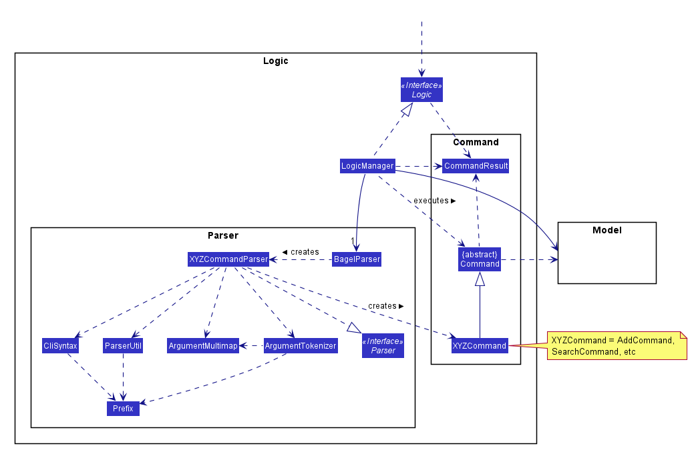

**How the architecture components interact with each other**

The *Sequence Diagram* below shows how the components interact with each other for the scenario where the user issues the command `delete 1`.

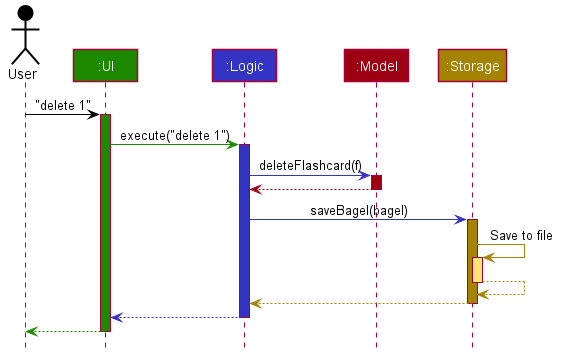

The sections below give more details of each component.

### UI component

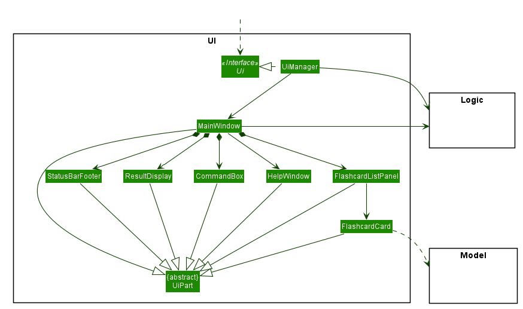

**API** :
[`Ui.java`](https://github.com/AY2021S1-CS2103T-W13-2/tp/blob/master/src/main/java/seedu/address/ui/Ui.java)

The UI consists of a `MainWindow` that is made up of parts e.g.`CommandBox`, `ResultDisplay`, `FlashcardListPanel`, `StatusBarFooter` etc. All these, including the `MainWindow`, inherit from the abstract `UiPart` class.

The `UI` component uses JavaFx UI framework. The layout of these UI parts are defined in matching `.fxml` files that are in the `src/main/resources/view` folder. For example, the layout of the [`MainWindow`](https://github.com/AY2021S1-CS2103T-W13-2/tp/blob/master/src/main/java/seedu/address/ui/MainWindow.java) is specified in [`MainWindow.fxml`](https://github.com/AY2021S1-CS2103T-W13-2/tp/blob/master/src/main/resources/view/MainWindow.fxml)

The `UI` component,

* Executes user commands using the `Logic` component.
* Listens for changes to `Model` data so that the UI can be updated with the modified data.

### Logic component

**API** :
[`Logic.java`](https://github.com/AY2021S1-CS2103T-W13-2/tp/blob/master/src/main/java/seedu/address/logic/Logic.java)

1. `Logic` uses the `BagelParser` class to parse the user command.
1. This results in a `Command` object which is executed by the `LogicManager`.
1. The command execution can affect the `Model` (e.g. adding a flashcard).
1. The result of the command execution is encapsulated as a `CommandResult` object which is passed back to the `Ui`.
1. In addition, the `CommandResult` object can also instruct the `Ui` to perform certain actions, such as displaying help to the user.

Given below is the Sequence Diagram for interactions within the `Logic` component for the `execute("delete 1")` API call.

:information_source: **Note:** The lifeline for `DeleteCommandParser` should end at the destroy marker (X) but due to a limitation of PlantUML, the lifeline reaches the end of diagram.

### Model component

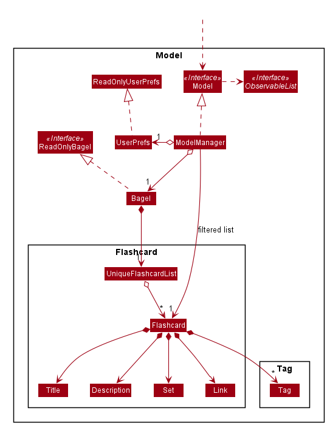

**API** : [`Model.java`](https://github.com/AY2021S1-CS2103T-W13-2/tp/blob/master/src/main/java/seedu/address/model/Model.java)

The `Model`,

* stores a `UserPref` object that represents the user’s preferences.
* stores Bagel data.
* exposes an unmodifiable `ObservableList<Flashcard>` that can be 'observed' e.g. the UI can be bound to this list so that the UI automatically updates when the data in the list change.
* does not depend on any of the other three components.

### Storage component

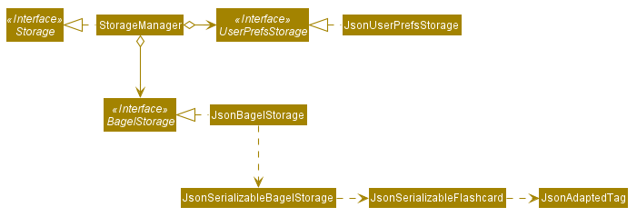

**API** : [`Storage.java`](https://github.com/AY2021S1-CS2103T-W13-2/tp/tree/master/src/main/java/seedu/address/storage/Storage.java)

The `Storage` component,
* can save `UserPref` objects in json format and read it back.
* can save Bagel data in json format and read it back.

### Common classes

Classes used by multiple components are in the `seedu.bagel.commons` package.

--------------------------------------------------------------------------------------------------------------------
## **Implementation**

This section describes some noteworthy details on how certain features are implemented.

### Add Feature

#### Implementation

The add feature is facilitated by LogicManager and ModelManager. The add command supports the following inputs from the user:
* `t/TITLE`
* `d/DESCRIPTION`
* `s/SET`
* `l/LINK`
* `tag/TAG`

Title and Description are mandatory inputs while the rest are optional inputs. When the user adds a flashcard, the user’s inputs
will be passed on to ParserUtil. ParserUtil will conduct input validation and trim any leading and trailing whitespaces.
If the user’s inputs are valid and there are no duplicate flashcard, a Flashcard object will be created and added to the UniqueFlashcardList and setOfFlashcardSets in Bagel.
Otherwise ParseException will be thrown and the relevant error message will be displayed to the user.

It implements the following operations:

AddCommand#execute() - Add the flashcard to the ModelManager and setOfFlashcardSets
AddCommandParser#parse(String args) - Conduct input validation and parse user’s input

The following activity diagram summarizes what happens when a user executes the clear command.

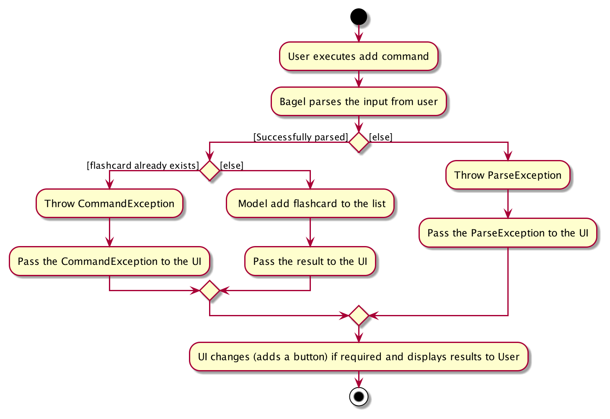

The following sequence diagrams show how the add operation works.

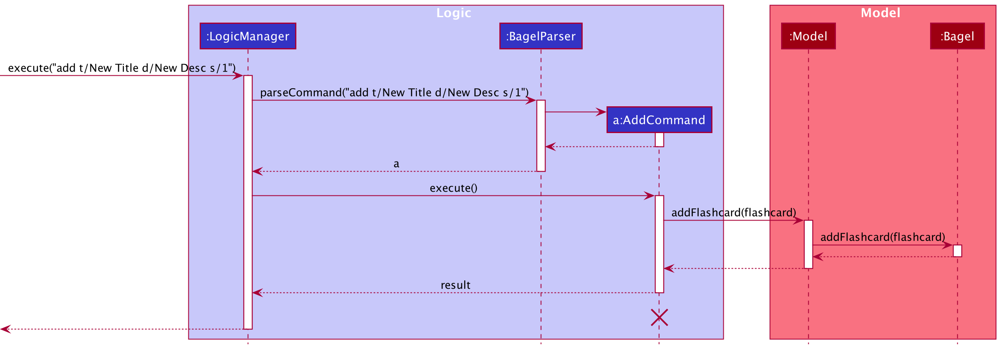

Given below is an example usage scenario and how the add feature behaves at each step.

1. The user executes `add t/New Title d/New Desc s/1` to add a flashcard of the title `New Title` and description `New Desc` into set `1`.
2. `BagelParser` creates an `AddCommandParser` and calls its parse method, ParserUtil#parseTitle, ParserUtil#parseDescription,
ParserUtil#parseSet, (ParserUtil#parseLink, ParserUtil#parseTags if necessary), with the arguments passed in by the user to check for input validation (no duplicate flashcard in Bagel).
3. If validation is successful, `AddCommandParser` calls the constructor of Flashcard and creates a flashcard. Consequently, a new AddCommand with the flashcard as the parameter is created.
4. LogicManager then calls AddCommand#execute(Model model).
5. AddCommand then add a flashcard to the flashcard list by calling Model#addFlashcard.
6. A CommandResult is generated and Model updates the filteredFlashcardList by adding the flashcard which is then updated in the UI.
7. If the set that the newly created flashcard is empty, a button is created in the UI side bar.

#### Design considerations

* **Current implementation:** Flashcard is saved in Bagel upon creation.
  * Pros: Easy to implement and CLI-optimized.
  * Cons: Could become more complicated in the future as there will be too many prefixes for the `add` command to parse.
  
### Search feature

#### Implementation

This mechanism makes use of the unmodifiable `ObservableList<Flashcard>` in `Model`. It filters the given list by searching
for the flashcard that matches the given keyword.

The following sequence diagrams show how the search operation works.

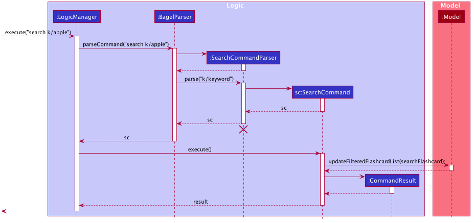

1. The user executes `search k/apple` to search flashcards that has matching title, description, or tag to the keyword in the list currently shown.
2. `BagelParser` creates an `SearchCommandParser` and calls its parse method with the arguments passed in by the user.
3. `SearchCommandParser` returns a new `SearchCommand` with the `keyword` to be searched.
4. When its execute method is called, `SearchCommand` calls `updateFilteredFlashcardList()` with predicate, `searchFlashcard`.
5. `Model` will update flashcards based on the predicate.
7. The result of this command is returned.

#### Design consideration

##### Aspect: How to pass fields to be edited

* **Alternative 1 (current choice):** Pass fields to be edited into `SearchCommand` directly
  * Pros: Easier to implement.
  * Cons: `SearchCommand` will have more responsibilities.
* **Alternative 2:** Store fields in `SearchFlashcardDescriptor` and pass it into `SearchCommand`
  * Pros: Better separation of concerns.
  * Cons: More code to write.

I chose alternative 1, because only field for search command is `keyword` and amount of responsibilities for `SearchCommand` will not increase a lot.

### View feature

#### Implementation

This mechanism makes use of the unmodifiable `ObservableList<Flashcard>` in `Model`. It filters the given list by searching for
for the flashcard that matches the given index.

*diagram to be included*

### List feature

#### Implementation

This mechanism makes use of the unmodifiable `ObservableList<Flashcard>` in `Model`. It filters the list based on the parameters passed with the command word `list`.

Its implementation is similar to that of the *Search* feature, with the difference being in point 4.
* If there are no parameters passed with the command `list`, `ListCommand ` calls `updateFilteredFlashcardList()` with predicate `PREDICATE_SHOW_ALL_FLASHCARDS`.
* If a parameter is passed with the command, for example `list s/2`, `ListCommand` calls `updateFilteredFlashcardList()` with predicate `predicateShowFlashcardsInSet`.

The following sequence diagram shows how the list operation works with parameters.

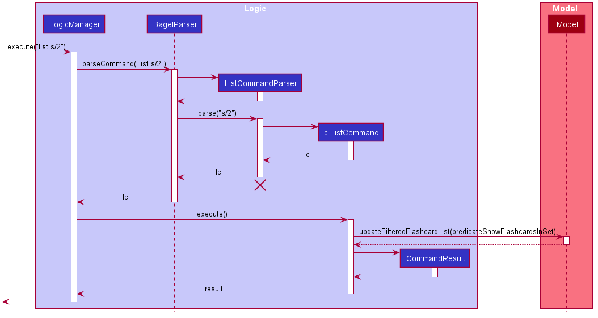

#### Design consideration

##### Aspect: How to parse the parameters passed with the `list` command
* **Alternative 1:** Pass it into the ListCommand class directly.
  * Pros: Easier to implement.
  * Cons: `ListCommand` has more responsibilities, such as to parse the presence of parameters.

* **Alternative 2 (current choice):** Create a `ListCommandParser` to parse parameters if there are any.
  * Pros: Delegates the different responsibilities to each class.
  * Cons: More code to write, as the original implementation of the `list` command in AB3 did not allow parameters to be passed.

I chose alternative 2, because even though the increase in responsibility for `ListCommand` is rather minimal, parsing of parameters should still be separated from execution of commands.

### Edit Feature

#### Implementation

The edit mechanism involves an additional `EditFlashcardDescriptor` class to pass the content of the fields to be edited into `EditCommand`.

The following sequence diagrams show how the edit operation works.

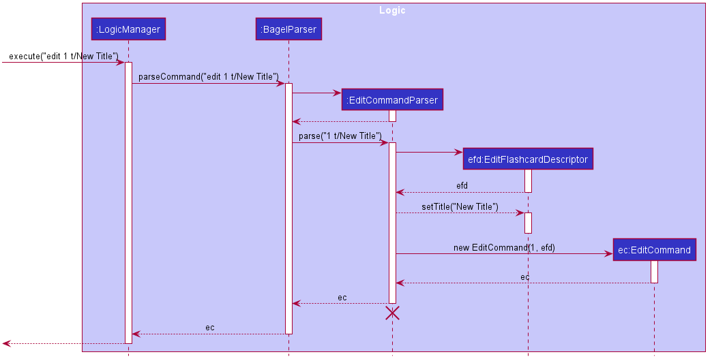

1. The user executes `edit 1 t/New Title` to edit the title of the first flashcard in the list currently shown.
2. `BagelParser` creates an `EditCommandParser` and calls its parse method with the arguments passed in by the user.
3. `EditCommandParser` creates an `EditFlashcardDescriptor`.
4. For each field in the flashcard, `EditCommandParser` checks if there is an updated version provided by the user. If there is, the new content is added into the `EditFlashcardDescriptor`.
5. `EditCommandParser` returns a new `EditCommand` with the index of the `Flashcard` to be edited and the `EditFlashcardDescriptor`.

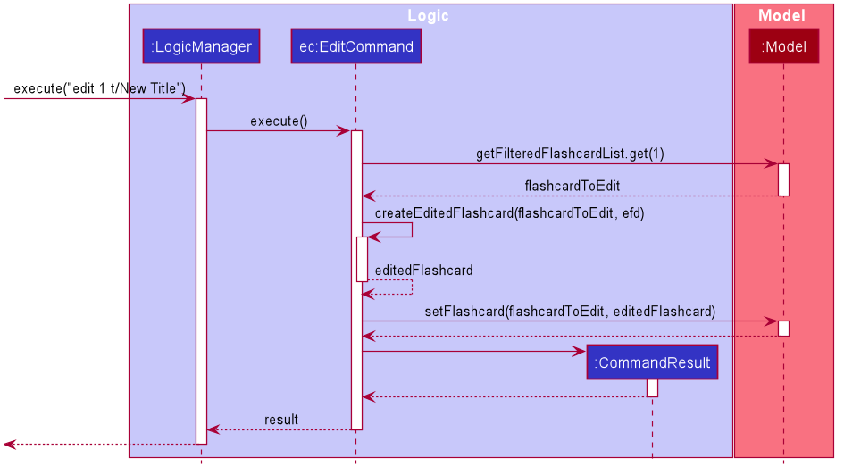

1. When its execute method is called, `EditCommand` gets the `Flashcard` to edit from `Model`.
2. `EditCommand` creates a new `Flashcard` based on the `EditFlashcardDescriptor` and the `Flashcard` to be edited.
3. This new `Flashcard` replaces the old `Flashcard` in `Model`.
4. The result of this command is returned.

#### Design consideration

##### Aspect: How to pass fields to be edited

* **Alternative 1 (current choice):** Store fields in `EditFlashcardDescriptor` and pass it into `EditCommand`
  * Pros: Better separation of concerns.
  * Cons: More code to write.
* **Alternative 2:** Pass fields to be edited into `EditCommand` directly
  * Pros: Easier to implement.
  * Cons: `EditCommand` will have more responsibilities.
  
### View Feature

#### Implementation

This mechanism makes use of the unmodifiable `ObservableList<Flashcard>` in `Model`. It filters the list by making use of the predicate
to filter out the desired flashcard.

1. The user executes `search k/apple` to search flashcards that has matching title, description, or tag to the keyword in the list currently shown.
2. `BagelParser` creates an `SearchCommandParser` and calls its parse method with the arguments passed in by the user.
3. `SearchCommandParser` returns a new `SearchCommand` with the `keyword` to be searched.
4. When its execute method is called, `SearchCommand` calls `updateFilteredFlashcardList()` with predicate, `searchFlashcard`.
5. `Model` will update flashcards based on the predicate.
7. The result of this command is returned.

Its implementation is similar to that of the *Search* feature, with the difference being in point 4.
* If there are no parameters passed with the command `list`, `ListCommand ` calls `updateFilteredFlashcardList()` with predicate `PREDICATE_SHOW_ALL_FLASHCARDS`.
* If a parameter is passed with the command, for example `list s/2`, `ListCommand` calls `updateFilteredFlashcardList()` with predicate `predicateShowFlashcardsInSet`.

The following sequence diagram shows how the list operation works with parameters.

#### Design consideration

##### Aspect: How to parse the parameters passed with the `list` command

* **Alternative 1:** Pass it into the ListCommand class directly.
  * Pros: Easier to implement.
  * Cons: `ListCommand` has more responsibilities, such as to parse the presence of parameters.

* **Alternative 2 (current choice):** Create a `ListCommandParser` to parse parameters if there are any.
  * Pros: Delegates the different responsibilities to each class.
  * Cons: More code to write, as the original implementation of the `list` command in AB3 did not allow parameters to be passed.

I chose alternative 2, because even though the increase in responsibility for `ListCommand` is rather minimal, parsing of parameters should still be separated from execution of commands.

#### Design consideration

##### Aspect: How to pass fields to be edited

* **Alternative 1 (current choice):** Store fields in `EditFlashcardDescriptor` and pass it into `EditCommand`
  * Pros: Better separation of concerns.
  * Cons: More code to write.
* **Alternative 2:** Pass fields to be edited into `EditCommand` directly
  * Pros: Easier to implement.
  * Cons: `EditCommand` will have more responsibilities.

### Clear feature

#### Implementation

The following activity diagram summarizes what happens when a user executes the clear command.

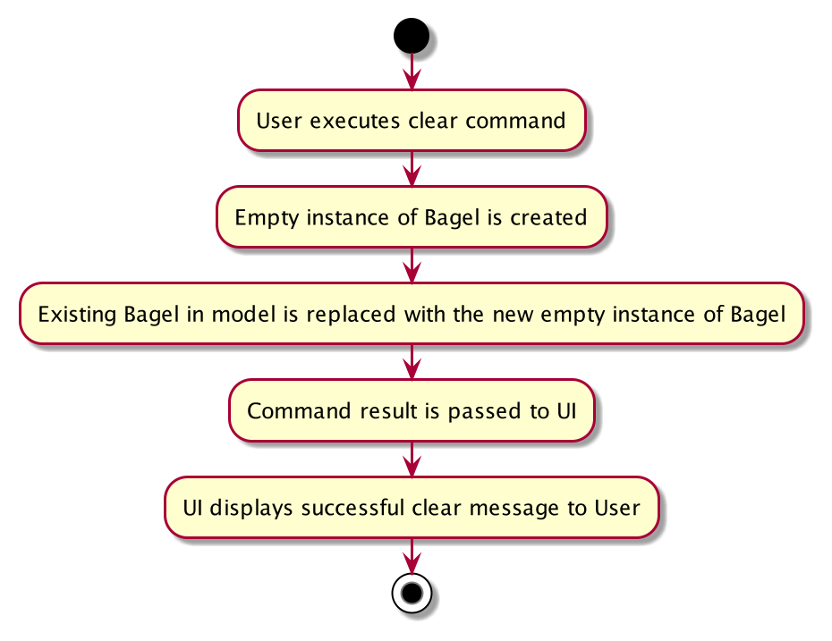

The Clear mechanism will allow the user to delete all flashcards in their local hard drive (local Bagel).

The implementation makes use of the `Model#setBagel` and `Bagel`. A new instance of `Bagel` without any existing flashcards will replace the users current `Bagel` in `Model`.

##### Usage

Given below is an example usage scenario and how the Clear feature behaves at each step.

Step 1. The user executes `clear` command to clear all flashcards in his local QuickCache.

Step 2. `ClearCommand#execute` will replace the current instance of `QuickCache` with a new empty instance of `QuickCache` through the `Model#setQuickCache` method.

Step 3. After execution, `CommandResult` will contain a message indicating that it has cleared QuickCache.

1. The user executes `clear` to clear all flashcards in their local Bagel.
2. `ClearCommand#execute` will replace the current instance of `Bagel` with a new empty instance of `Bagel` through the `Model#setBagel` method.
3. After execution, a `CommandResult` is generated and will contain a message indicating that it has successfully cleared Bagel.

The following sequence diagram shows how the Clear mechanism works:

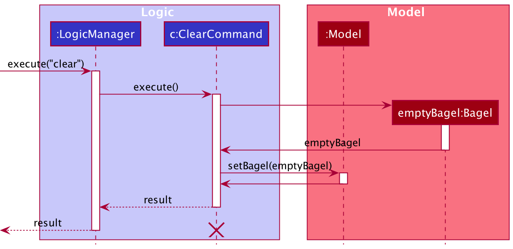

#### Design Considerations:

##### Aspect: How to clear all the current flashcards in Bagel

* **Alternative 1 (current choice):** Replaces the existing `Bagel` in model with a new `Bagel` that is empty.
  * Pros: Easy to implement - minimizes the occurrence of bugs or remnant flashcards that failed deletion.
  * Cons: Waste of resources/inefficient as a new `Bagel` instance needs to be created when a user wants to clear Bagel.

* **Alternative 2:** Delete all the flashcards currently in Bagel by reiteration
  * Pros: More efficient than alternative 1 if there are only a few flashcards in Bagel at the moment of clearance.
  * Cons: Rate of inefficiency increases exponentially with the number of flashcards added into Bagel.
  
--------------------------------------------------------------------------------------------------------------------

## **Documentation, logging, testing, configuration, dev-ops**

* [Documentation guide](Documentation.md)
* [Testing guide](Testing.md)
* [Logging guide](Logging.md)
* [Configuration guide](Configuration.md)
* [DevOps guide](DevOps.md)

--------------------------------------------------------------------------------------------------------------------

## **Appendix: Requirements**

### Product scope

**Target user profile**:

* computing students taking GER1000
* wants to memorise content taught in GER1000
* has a need to manage a significant number of flashcards
* prefer desktop apps over other types
* can type fast
* prefers typing to mouse interactions
* is reasonably comfortable using CLI apps

**Value proposition**:
Bagel is a flashcard application faster than a typical mouse/GUI driven app with additional functionality such as
adding tags, links, or comments. It targets computing students taking GER1000 because it is a module that requires
memorising many keywords and items, and computing students would prefer typing over other means of input.

### User stories

Priorities: High (must have) - `* * *`, Medium (nice to have) - `* *`, Low (unlikely to have) - `*`

| Priority | As a …​                                    | I want to …​                     | So that I can…​                                                        |
| -------- | ------------------------------------------ | ------------------------------ | ---------------------------------------------------------------------- |
| `* * *`  | user                                       | add flashcards                 | memorise them                 |
| `* * *`  | user                                       | delete my flashcards when I am done with them               | keep the list organised                                                                       |
| `* * *`  | user                                       | edit a flashcard                |  rephrase or fix mistakes that I originally wrote                                   |
| `* * *`  | user                                       | view individual flashcards          | read them |
| `* * *`    | user                                       | view a list of sets of flashcards that I currently have   | not mix them up                |
| `* * *`      | user  | “flip” through a set of flashcards           | memorise them                                                 |
| `* *`     |  user                             | tag flashcards        | revise a certain topic easily |
| `* *` | forgetful user | search for flashcards | 
| `* *` | user | sort my flashcards | keep the list organised | 
| `* *` | user | add links to my flashcards | find the particular lecture slide/notes by clicking on it | 
| `* *` | user | add flashcards to sets | memorise relevant flashcards together | 
| `*` | first time user | view all possible commands | navigate the app easily | 
| `*` | user ready to start using the app | clear all flashcards | get rid of sample/experimental flashcards I used for exploring the app |

### Use cases

(For all use cases below, the **System** is `Bagel` and the **Actor** is the `user`, unless specified otherwise)

**Use case: UC01 - Adding a flashcard**

**MSS**

1. User chooses to add a flashcard.
2. User enters the relevant details of the flashcard they would like to add.
3. System adds the flashcard and shows the new list of flashcards.

Use case ends.

**Extensions**
* 2a. System detects an error in the entered data.
    * 2a1. System requests for the correct data.
    * 2a2. User enters new details. 
    Steps 2a1-2a2 are repeated until the data entered are correct.
 
Use case resumes from step 3.

**Use case: UC02 - Deleting a flashcard**

**MSS**

1. User chooses to delete a flashcard.
2. User <u>lists the entire list of flashcards. (UC)</u>
3. User enters the index of the flashcard they would like to delete.
4. System deletes the flashcard and shows the new list of flashcards.

Use case ends.

**Extensions**

* 3a. Similar to extension of UC01.

Use case resumes from step 4.

**Use case: UC03 - Editing a flashcard**

**MSS**

1. User chooses to edit a flashcard.
2. User <u>lists the entire list of flashcards. (UC05)</u>
3. User enters the index of the flashcard they would like to edit, and the details to edit.
4. System edits the flashcard and shows the edited flashcard.

Use case ends.

**Extensions**

* 3a. Similar to extension of UC01.

Use case resumes from step 4.

**Use case: UC04 - Viewing a flashcard**

**MSS**

1. User chooses to view a flashcard.
2. User enters the index of the flashcard they would like to view.
3. System displays the flashcard.

Use case ends.

**Extensions** 

* 2a. Similar to extension of UC01.

Use case resumes from step 3.

**Use case: UC05 - Listing all flashcards**

**MSS**

Similar to UC04, except user enters relevant details for listing all flashcards. 

**Use case: UC06 - Flipping through flashcards**

**MSS**

1. User chooses to flip through the list of flashcards.
2. User enters the relevant details to start viewing from the first flashcard in the list.
3. System shows the first flashcard.
4. User enters the relevant details to view the next flashcard in the list.
5. System shows the next flashcard. 
Steps 4-5 are repeated for each flashcard, until the user reaches the end of the list.
6. System shows the first flashcard.

Use case ends.

**Extensions**

* 2a/4a. Similar to extension of UC01.

Use case resumes from step 3/5.

**Use case: UC07 - Searching through flashcards**

**MSS**

Similar to UC04, except user enters relevant details for searching.  

Use case resumes from step 3.

**Use case: UC08 - Sorting flashcards** 

**MSS** 

Similar to UC04, except user enters relevant details for sort. 

**Use case: UC09 - Clearing flashcards**

**MSS**

Similar to UC04, except user enters relevant details for clear. 

### Non-Functional Requirements

1. Bagel should work on any _mainstream OS_ as long as it has Java `11` or above installed.
2. Bagel should be able to hold up to 500 flashcards without a noticeable sluggishness in performance for typical usage.
3. Bagel should be intuitive to use for first time users.
4. Bagel should be targeting users who can type fast and prefer typing over other means of input.
5. Bagel should respond within two seconds.
6. Bagel should show flashcards within one second of inputting the command.
7. Any version of Bagel should function as long as the user has it installed.
8. Bagel is expected to adhere to the CS2103T schedule.
9. Bagel is not expected to quiz the user.
10. Bagel should be for a single user.

### Glossary

* **Mainstream OS**: Windows, Linux, Unix, OS-X
* **Command Line Interface (CLI)**: Text based user interface.
* **Graphical User Interface (GUI)**: User interface that allows users to interact via icons and graphics.

--------------------------------------------------------------------------------------------------------------------

## **Appendix: Instructions for manual testing**

Given below are instructions to test the app manually.

:information_source: **Note:** These instructions only provide a starting point for testers to work on;
testers are expected to do more *exploratory* testing.

### Launch and shutdown

1. Initial launch

   1. Download the jar file and copy into an empty folder.

   1. Double-click the jar file. 
      Expected: Shows the GUI with a set of sample flashcards. The window size may not be optimum.

1. Saving window preferences

   1. Resize the window to an optimum size. Move the window to a different location. Close the window.

   1. Re-launch the app by double-clicking the jar file. 
      Expected: The most recent window size and location is retained.

### Deleting a flashcard

1. Deleting a flashcard while all flashcards are being shown

   1. Prerequisites: List all flashcards using the `list` command. Multiple flashcards in the list.

   1. Test case: `delete 1` 
      Expected: First contact is deleted from the list. Details of the deleted contact shown in the status message. Timestamp in the status bar is updated.

   1. Test case: `delete 0` 
      Expected: No flashcard is deleted. Error details shown in the status message. Status bar remains the same.

   1. Other incorrect delete commands to try: `delete`, `delete x`, `...` (where x is larger than the list size) 
      Expected: Similar to previous.

### Saving data

1. Dealing with missing/corrupted data files

   1. _{explain how to simulate a missing/corrupted file, and the expected behavior}_

